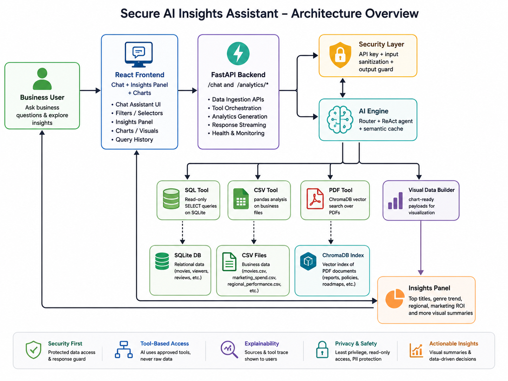

# DudePLIX — Secure AI Insights Assistant
.png)
.png)


A secure, multi-source internal analytics assistant for entertainment leadership.
It answers business questions by orchestrating three trusted data layers:
SQL, CSV/Excel-style business files, and private PDF reports.
The goal of this build is not just to answer questions — it is to answer them **safely, explainably, and with source attribution**.

---

## [Github Link](https://github.com/manan-dude/DudePLIX.git)

## What this solution demonstrates

- **Secure AI orchestration** with input sanitization, output guardrails, and API-key protection.
- **Multi-source reasoning** across structured database tables, CSV analytics files, and internal PDF documents.
- **LLM tool usage** through a controlled backend agent instead of unrestricted raw data access.
- **A usable leadership dashboard** with chat, filters, analytics charts, source badges, and tool traces.
- **Docker-first deployment** for easy demoing and evaluation.

---

## Problem statement coverage

This project directly addresses the assignment requirements:

- Structured data from a relational database: **SQLite**
- Unstructured data from PDFs/internal documents: **ChromaDB + PDF indexing**
- CSV / spreadsheet business data: **pandas-based CSV tools**
- Backend APIs for ingestion/query/retrieval/orchestration: **FastAPI**
- Frontend chat + insights + charts: **React + Vite**
- Security and explainability: **guardrails, API keys, source badges, tool trace**

It is built to answer questions like:

- Which titles performed best in 2025?
- Why is a specific title trending?
- Which genre is growing fastest?
- What audience segments are most engaged?
- What action should leadership take next quarter?

---

## Architecture overview



---

## Core features

### 1) Secure chat assistant
The `/chat` endpoint accepts a business question, sanitizes the input, routes it to the correct tools, and returns:
- answer text
- sources used
- tool trace
- chart-ready visual data when applicable
- cache status
- session id for multi-turn continuity

### 2) Multi-source intelligence
The assistant can combine:
- **SQL** for rankings, counts, comparisons, ratings, and structured analytics
- **CSV** for marketing spend, region performance, viewers, reviews, and genre summaries
- **PDF** for strategic and qualitative questions like “why”, “recommend”, and “what should leadership do”

### 3) Security and privacy controls
Implemented in the backend:
- API key protection on protected routes
- prompt-injection blocking on incoming user messages
- SELECT-only SQL enforcement
- pandas-expression safety checks
- LLM output redaction for obvious PII / internal-leak patterns
- controlled tool access instead of raw unrestricted data exposure

### 4) Semantic cache
A similarity-based semantic cache reduces repeated work for near-duplicate questions and returns cached answers when the similarity threshold is met.

### 5) Visual summaries
The system can automatically produce chart-friendly output for queries involving:
- top titles
- comparisons
- trends
- engagement
- spend / ROI
- views

The frontend also includes a pinned dashboard area for keeping selected charts visible.

---

## Data sources included in the repo

### Structured data
Stored in `backend/data/` and available to the assistant through SQL and CSV analysis:

- `movies.csv`
- `viewers.csv`
- `watch_activity.csv`
- `reviews.csv`
- `marketing_spend.csv`
- `regional_performance.csv`
- `entertainment.db`

### PDF knowledge base
Stored in `backend/docs/` and indexed on first run into ChromaDB:

- `StreamSphereOTT.pdf`
- `dev_of_film_industry.pdf`

---

## Frontend experience

The React frontend includes:

- a chat interface for asking business questions
- suggested prompts for quick demoing
- source badges to show whether the answer came from SQL, CSV, or PDF retrieval
- a collapsible tool trace for transparency
- visual summaries through Recharts
- an insights panel with ready-made analytics views:
  - Top Titles
  - Genre Trend
  - Regional Engagement
  - Marketing ROI

---

## Backend APIs

### Chat
`POST /chat`

Example request:
```json
{
  "message": "Which titles performed best in 2025?",
  "source_mode": "auto",
  "session_id": null
}
```

### Analytics
- `GET /analytics/top-titles`
- `GET /analytics/genre-trend`
- `GET /analytics/regional`
- `GET /analytics/marketing-roi`
- `GET /analytics/cache-stats`

### Health
- `GET /health`

---

## Technology stack

### Backend
- FastAPI
- LangChain
- LangGraph-compatible tool orchestration
- SQLite
- pandas
- ChromaDB
- Ollama-compatible LLM + embeddings

### Frontend
- React
- Vite
- Recharts
- Lucide icons
- React Markdown
- Tailwind in the build pipeline

### Deployment
- Docker
- Docker Compose
- nginx reverse proxy for the frontend container

---

## Security model

This project is intentionally designed as a secure internal assistant.

### Access control
Protected endpoints require `X-API-Key` in non-development mode.

### Query safety
SQL execution is restricted to `SELECT` only.
Destructive operations such as `DROP`, `DELETE`, `UPDATE`, and similar patterns are blocked.

### Prompt-injection defense
Incoming prompts are scanned for common injection phrases such as:
- “ignore previous instructions”
- “system prompt”
- “jailbreak”
- “you are now ...”

### Output protection
The assistant redacts obvious personal data patterns before returning the response.

### Data access discipline
The model does not receive raw database files or unrestricted filesystem access.
It only interacts through narrow, typed tools.

---

## How the AI layer works

1. User question is received by `/chat`.
2. Input is sanitized for obvious PII.
3. A semantic cache is checked.
4. A lightweight router selects the right tool set:
   - SQL for structured analytics
   - CSV for spreadsheet-style analysis
   - PDF for report-style insight retrieval
5. A ReAct-style agent queries the selected tools.
6. The final response is post-processed by guardrails.
7. Tool traces, sources, and chart payloads are returned to the frontend.

The session layer keeps a short multi-turn history so follow-up questions stay context-aware.

---

## Setup instructions

### 1) Prerequisites
- Docker and Docker Compose
- A running Ollama-compatible model endpoint, or another OpenAI-compatible provider configured in `.env.docker`

### 2) Configure environment
The repository includes `backend/.env.example` as the template.
For Docker runs, copy it to **`backend/.env.docker`** and update the values.

```bash
cp backend/.env.example backend/.env.docker
```

Recommended values for local Ollama-style setup:

```env
OLLAMA_HOST=http://host.docker.internal:11434/v1
OLLAMA_EMBED_URL=http://host.docker.internal:11434
OLLAMA_MODEL=gemma3:12b
EMBED_MODEL=nomic-embed-text
ENVIRONMENT=development
```

`docker-compose.yml` is already configured to read `backend/.env.docker`.

### 3) Start with Docker Compose
```bash
docker compose up --build
```

### 4) Open the application
- Frontend: `http://localhost:3000`
- Backend docs: `http://localhost:8000/docs` (available in development mode)

---

## Local development setup

### Backend
```bash
cd backend
pip install -r requirements.txt
uvicorn app.main:app --reload --port 8000
```

### Frontend
```bash
cd frontend
npm install
npm run dev
```

---

## Environment variables

The backend reads its configuration from the environment or from the file specified by `ENV_FILE_PATH`.
If `ENV_FILE_PATH` is not set, it falls back to `.env`.

Key variables:
- `OLLAMA_HOST`
- `OLLAMA_API_KEY`
- `OLLAMA_MODEL`
- `OLLAMA_EMBED_URL`
- `EMBED_MODEL`
- `INTERNAL_API_KEY`
- `API_KEY_HEADER`
- `DB_PATH`
- `CHROMA_DB_PATH`
- `DOCS_DIR`
- `CSV_DIR`
- `CACHE_SIMILARITY_THRESHOLD`
- `LOG_LEVEL`
- `ENVIRONMENT`

---

## Assumptions and Tradeoffs

- **SQLite** is used for the structured layer to keep the project lightweight, portable, and easy to run in Docker without external infrastructure.
- **CSV files are analyzed directly with pandas** instead of building a separate ingestion service, since the goal is fast, transparent demo execution rather than a multi-tenant ETL pipeline.
- **PDFs are indexed locally in ChromaDB** so retrieval stays fast and self-contained; this avoids dependency on external vector databases during evaluation.
- **Tool routing uses keyword and intent heuristics first**, then agent reasoning, to reduce unnecessary tool calls and make the system more predictable for business questions.
- **The semantic cache is in-memory** because the current scope is a single-container demo; for production, it should be replaced with a shared cache such as Redis to support scale and persistence.
- **Development mode is optimized for easy demoing**, so some production controls like strict API-key enforcement and deeper rate limiting are relaxed locally to reduce setup friction.
- **The model layer is assumed to be Ollama-compatible**, which keeps the solution flexible for local or on-premise LLM hosting without locking the architecture to one vendor.
- **Answer generation favors explainability over verbosity**, so the assistant returns source-backed insights, tool traces, and compact summaries instead of long free-form reports.
- **The data model assumes static or slowly changing business datasets**, which fits the provided assignment context; highly dynamic data would require scheduled refreshes and stronger sync logic.
- **Visualization outputs are purpose-built for the dashboard**, meaning the system generates chart-ready summaries rather than full BI-grade reporting exports.
- **Security is implemented with least-privilege access patterns**, but the project still assumes trusted internal deployment conditions; a production deployment would need stronger auth, auditing, and secrets management.
- **The architecture is designed for a strong proof of concept**, not maximum scale. The tradeoff is simplicity and clarity now, with clear upgrade paths later for distributed storage, queueing, and persistent caching.

---


## Project structure

```text
DudePLIX-main/
├── backend/
│   ├── app/
│   │   ├── core/
│   │   │   ├── config.py          # Pydantic settings (env-driven)
│   │   │   ├── security.py        # API-key auth middleware
│   │   │   ├── guardrails.py      # SQL/Pandas sanitisation + LLM output guard
│   │   │   └── semantic_cache.py  # Embedding-based query cache (Redis/in-memory)
│   │   ├── models/
│   │   │   └── schemas.py         # Pydantic request/response models
│   │   ├── routers/
│   │   │   ├── chat.py            # POST /chat
│   │   │   └── analytics.py       # GET /analytics/* (charts data)
│   │   ├── services/
│   │   │   ├── ai_engine.py       # LangChain agent + smart router
│   │   │   ├── vector_store.py    # ChromaDB PDF indexer/retriever
│   │   │   └── db.py              # SQLite connection pool
│   │   ├── tools/
│   │   │   ├── sql_tool.py        # read-only SQL executor
│   │   │   ├── csv_tool.py        # pandas CSV analyser
│   │   │   └── pdf_tool.py        # vector similarity search
│   │   └── main.py                # FastAPI app factory
│   ├── data/                      # SQLite + CSVs (git-ignored in prod)
│   ├── docs/                      # PDFs
│   ├── .env.example
│   ├── requirements.txt
│   └── Dockerfile
├── frontend/
│   ├── src/
│   │   ├── components/
│   │   │   ├── ChatPanel.jsx
│   │   │   ├── InsightsPanel.jsx
│   │   │   ├── SourceBadge.jsx
│   │   │   └── Charts.jsx
│   │   ├── App.jsx
│   │   └── main.jsx
│   ├── index.html
│   ├── package.json
│   └── Dockerfile
├── docker-compose.yml
└── README.md

```

---

