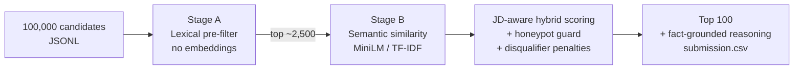

<div align="center">

# 🎯 TalentRank

### Intelligent Candidate Discovery & Ranking — at scale, on a laptop

**Rank the 100 best-fit candidates out of 100,000 against a job description in ~3 minutes — CPU-only, no GPU, no network, no per-candidate LLM calls.**


</div>

---

## Why this exists

Most "AI matching" tools are a thin wrapper around an embedding model: paste a JD,
cosine-similarity against a candidate pool, return the top-K. That approach looks
clever in a demo and **fails in the real world** because it ranks on *vocabulary*,
not *fit*. It happily promotes a Marketing Manager who listed "RAG, LoRA, Pinecone"
as skills, and it can't tell a genuine retrieval engineer from a keyword-stuffed
résumé.

TalentRank is built for the messy reality of a 100K-candidate pool seeded with
**keyword stuffers, wrong-role traps, behavioral no-shows, and impossible-profile
honeypots** — and it does it inside a hard production budget: **≤ 5 min, ≤ 16 GB
RAM, CPU-only, zero network at ranking time.** A system that calls a hosted LLM per
candidate can't scale to a real talent platform; this one can.

> Built for the **Redrob "Intelligent Candidate Discovery & Ranking" Challenge** —
> ranking candidates for a *Senior AI Engineer — Founding Team* role.

---

## ✨ What makes it different

| | Naive embedding ranker | **TalentRank** |
|---|---|---|
| **Reads between the lines** | Matches keywords | Weights real **role-history evidence** far above the stuffable skills list |
| **Wrong-role traps** | Ranks "Graphic Designer w/ AI skills" #1 | Role-relevance gate + disqualifier penalties sink them |
| **Impossible profiles** | Invisible | Dedicated **honeypot detector** (e.g. *"88 months on Pinecone, 6 years total experience"*) |
| **Explanations** | None / templated | **Fact-grounded reasoning** per candidate, with honest concerns |
| **Compute** | One giant embed pass (won't fit budget) | Two-stage **retrieve → re-rank**: embeds only a ~2.5K shortlist |
| **Network** | Calls a hosted API | **Fully offline**, with an automatic TF-IDF fallback |

---

## 📊 Results (full 100,000-candidate pool, laptop CPU)

```
[1/4] Loaded 100,000 candidates                          6.8s
[2/4] Stage A — lexical pre-filter → 2,500 shortlist    80.1s
[3/4] Stage B — semantic (MiniLM) + hybrid scoring      88.8s
[4/4] Wrote 100 rows → submission.csv
      honeypots in top-100: 0 (0.0%)   ✅ well under the 10% DQ line
      Total wall-clock: ~3 min          ✅ inside the 5-min budget
```

**Top picks the system surfaced** (all genuine AI/ML roles at product companies — exactly the JD's target):

| # | Score | Candidate | Why |
|---|------|-----------|-----|
| 1 | 0.942 | Recommendation Systems Engineer @ **Saarthi.ai** (6.6y) | retrieval/ranking + embeddings in real role history |
| 2 | 0.934 | Search Engineer @ **Sarvam AI** (7.6y) | strong retrieval signal, 45-day notice |
| 3 | 0.933 | Applied ML Engineer @ **Sarvam AI** (6.6y) | product-company applied ML, ideal experience band |
| 4 | 0.924 | Senior Data Scientist @ **Sarvam AI** (7.4y) | retrieval/ranking + embeddings work |
| 5 | 0.918 | Machine Learning Engineer @ **LinkedIn** (6.9y) | strong fit for embeddings-retrieval + ranking focus |

Meanwhile, a plausible-looking *"Recommendation Systems Engineer"* with **88 claimed
months on Pinecone but only 6 years of total experience** was correctly demoted as a
honeypot — the kind of trap a pure-embedding ranker promotes straight to #1.

---

## 🧠 How it works

A two-stage **retrieve-then-rerank** pipeline. Embedding all 100K candidates on CPU
doesn't fit 5 minutes, so we filter cheaply first and spend the expensive compute
only where it matters.



**Stage B scoring** blends six interpretable signals, then applies multiplicative
penalties for the JD's explicit disqualifiers:

| Component | Weight | Signal |
|-----------|:------:|--------|
| 🧩 **domain** | 0.30 | retrieval/ranking, embeddings, vector DBs, evaluation, NLP/IR, production — **history weighted over skills** |
| 👤 **role** | 0.20 | genuine AI/ML/SWE title & career path (defeats wrong-role traps) |
| 🔎 **semantic** | 0.15 | embedding similarity to a distilled JD query |
| 📈 **experience** | 0.12 | fit to the 5–9y band (peak 6–8y) |
| 🏢 **company** | 0.11 | product company vs IT-services / consulting |
| 📡 **behavioral** | 0.12 | recruiter response, recency, open-to-work, notice period, location/relocation |

**Disqualifier penalties:** honeypot · role-mismatch · consulting-only · research-only ·
CV/speech-without-NLP · framework-only (LangChain tutorials) · behaviorally-unavailable ·
outside-India-no-relocate.

---

## 🚀 Quickstart

```bash
# 1. Install
pip install -r requirements.txt

# 2. (Recommended, while online) pre-cache the embedding model so ranking needs no network
python -c "from sentence_transformers import SentenceTransformer; SentenceTransformer('all-MiniLM-L6-v2')"

# 3. Rank — a single, reproducible command
python rank.py --candidates ./data/candidates.jsonl --out ./output/submission.csv
```

> No model cached / no internet? It automatically falls back to an offline TF-IDF
> cosine and still runs end-to-end. Force it with `--no-embeddings`.

**Handy flags:** `--shortlist N` (Stage-A size, default 2500) · `--top N` (rows to emit,
default 100) · `--no-embeddings` (offline TF-IDF backend).

The run prints per-stage timings, the honeypot rate in your top-100, and a top-5 preview.

---

## 📂 Project structure

```
rank.py                  Single-command entry point — the full pipeline
src/
├── jd_profile.py        The JD modeled as weighted signal groups + disqualifier patterns
├── prefilter.py         STAGE A — fast lexical scan over all 100K → shortlist
├── embedder.py          STAGE B — semantic similarity (MiniLM, offline; TF-IDF fallback)
├── honeypot.py          Impossible-profile detection
├── scorer.py            STAGE B — JD-aware hybrid scoring + reasoning generation
└── data_loader.py       Streaming JSONL/.gz loader + .docx JD parser
submission_metadata.yaml Reproducibility & environment metadata
```

---

## 📝 Example reasoning (no templating, no hallucination)

Every candidate gets a specific, profile-grounded explanation — citing real title,
company, years, evidence, and an honest concern when one exists:

> *"Machine Learning Engineer at LinkedIn (6.9y); product-company role history shows
> retrieval/ranking and embeddings work. Strong fit for the embeddings-retrieval and
> ranking-evaluation focus of the role."*

> *"Recommendation Systems Engineer at Swiggy (6y); profile lists retrieval/ranking and
> embeddings terms. Profile has internal inconsistencies (claims 88mo on skill 'Pinecone'
> but only 6.0y total experience), so treated as not credible."*

---

## ✅ Output format

`output/submission.csv` — exactly 100 rows of `candidate_id,rank,score,reasoning`,
score non-increasing with rank, each rank 1–100 used once, ties broken by
`candidate_id` ascending.

Validate before submitting:

```bash
python validate_submission.py output/submission.csv
```

---

## 🛠️ Tech stack

**Python 3.11** · scikit-learn · sentence-transformers (`all-MiniLM-L6-v2`) · NumPy ·
pandas · SciPy — see [`requirements.txt`](requirements.txt). No GPU, no external APIs.

---

## 💡 Design principles

1. **Evidence over vocabulary** — what you *did* (role history) outweighs what you *listed* (skills).
2. **Spend compute where it counts** — cheap recall first, expensive precision on the shortlist.
3. **Honesty is a feature** — every ranking comes with a reason a recruiter can read and trust.
4. **Production-real constraints** — if it can't run offline on a CPU in minutes, it doesn't ship.
